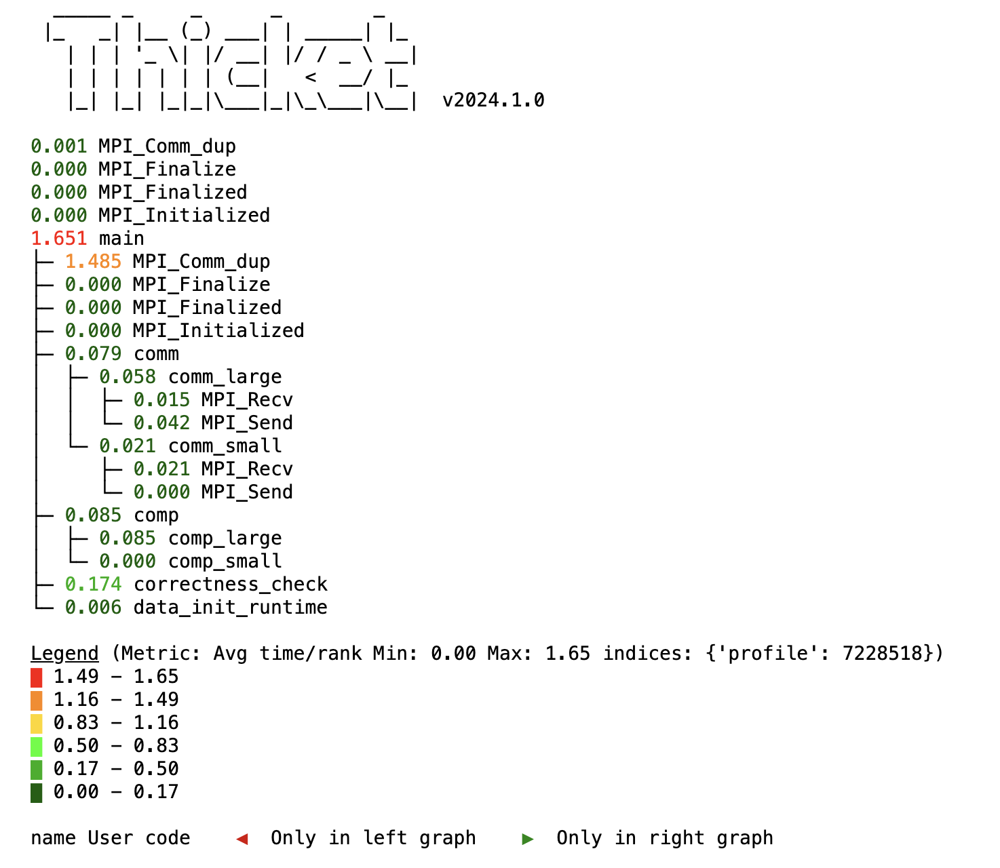

# CSCE 435 Group project

## 0. Group number: 
Group 1, Section 200

## 1. Group members:
1. Ariela Mitrani
2. Joseph Nuccitelli
3. Alexander Nuccitelli
4. Patralika Ghosh
5. Maximiliano Pombo

## 2. Parallel sorting algorithms

### 2a. Project communication
For this project, our team will communicate via Discord for planning, organization, and collaboration.

### 2b. Brief project description (what algorithms will you be comparing and on what architectures)
For this project, we will be comparing the following 5 algorithms:
- Bitonic Sort (Maximiliano)
- Sample Sort (Joseph)
- Merge Sort (Ariela)
- Radix Sort (Alex)
- Column Sort (Patralika)
  
We will be implementing everything with MPI for this project.

### 2c. Pseudocode for each parallel algorithm
- For MPI programs, include MPI calls you will use to coordinate between processes
#### Bitonic Sort: Maximiliano
```
// Bitonic Sort is a parallel sorting algorithm that is efficient for hardware implementations and works well in a parallel computing environment.
// It requires a bitonic Sequence which is a sequence that first increases and then decreases, or is entirely increasing or decreasing.
/* Fist thing to do is recursively divide the sequence into two halves, creating a bitonic sequence from the two halves.
Then merge the bitonic sequences into larger bitonic sequences until the entire sequence is sorted.
*/
//Time Complexity of O(log2n)

int totalElements = user_input_for_array_size;
int totalProcesses;
int currentProcessId;

MPI_Init(&argc, &argv);
MPI_Comm_rank(MPI_COMM_WORLD, &currentProcessId);
MPI_Comm_size(MPI_COMM_WORLD, &totalProcesses);

int chunkSize = totalElements / totalProcesses;
int[] localChunk = new int[chunkSize];

// Generate or receive the local part of the array
if (currentProcessId == 0) {
    int[] completeArray = generateArray(totalElements);
    MPI_Scatter(completeArray, chunkSize, MPI_INT, localChunk, chunkSize, MPI_INT, 0, MPI_COMM_WORLD);
} else {
    MPI_Scatter(NULL, chunkSize, MPI_INT, localChunk, chunkSize, MPI_INT, 0, MPI_COMM_WORLD);
}

// Bitonic Sort on the local chunk
bitonicSort(localChunk, chunkSize, currentProcessId, totalProcesses);

// Gather the sorted chunks back to the root process
int[] sortedArray;
if (currentProcessId == 0) {
    sortedArray = new int[totalElements];
}
MPI_Gather(localChunk, chunkSize, MPI_INT, sortedArray, chunkSize, MPI_INT, 0, MPI_COMM_WORLD);

// Output the sorted array
if (currentProcessId == 0) {
    printf(sortedArray); 
}
return;

// Perform Bitonic Sort
void bitonicSort(int[] array, int size, int currentProcessId, int totalProcesses) {
    for (int stepSize = 2; stepSize <= size; stepSize *= 2) { 
        for (int subStep = stepSize / 2; subStep > 0; subStep /= 2) {
            // Determine the direction (ascending or descending)
            int sortDirection = (currentProcessId % (stepSize / 2) == 0) ? 1 : 0;
            bitonicMerge(array, size, subStep, sortDirection);
        }
    }
}

// Perform Bitonic Merge
void bitonicMerge(int[] array, int size, int step, int sortDirection) {
    for (int i = 0; i < size; i++) {
        // Compare and swap based on direction
        if ((sortDirection == 1 && array[i] > array[i + step]) || (sortDirection == 0 && array[i] < array[i + step])) {
            swap(array[i], array[i + step]);
        }
    }

    // Send and/or receive data from neighbors
    if (totalProcesses > 1) {
        MPI_Sendrecv(array, size, MPI_INT, neighborProcessId, 0, 
                     array, size, MPI_INT, neighborProcessId, 0, MPI_COMM_WORLD, &status);
    }
}

// Swap elements helper function 
void swap(int &first, int &second) {
    int temp = first;
    first = second;
    second = temp;
}

```
#### Sample Sort: Joseph
```
int arraySize = user input for array size;
int procNum;
int taskId;

MPI_Init(&argc,&argv);
MPI_Comm_rank(MPI_COMM_WORLD,&taskid);
MPI_Comm_size(MPI_COMM_WORLD,&procNum);

if(procNum == 0){
  //create the array and fill it with elements
}
MPI_Scatter(array, sizeof(array)/nbuckets, MPI_DOUBLE,procArray, sizeof(array)/nbuckets, MPI_DOUBLE, 0, MPI_COMM_WORLD);
//quick sort the samples
std::sort(procArray);
MPI_Gather(all quick sorted elements);
//select the splitters using quicksort each process will do this to avoid extra communication

//put each element in the bucket
for(i = 0; i < size/nbuckets; ++i){
  correctBucket.insert(procArray[i]);
}
//each process sorts each bucket using quick sort
std::sort(bucket);

//array is sorted now


```
#### Merge Sort: Ariela
```
int arraySize = user input for array size;
int procNum;
int taskId;

MPI_Init(&argc,&argv);
MPI_Comm_rank(MPI_COMM_WORLD,&taskid);
MPI_Comm_size(MPI_COMM_WORLD,&procNum);

for(n in procNum) {
  if(taskid == n) {
    int children = childCount(n, procNum); //check if left child 2n+1 is in range, right child 2n+2 is in range

    int[] array;
    if(taskid == 0)
      array = generateArray(arraySize); //this fills our array with values
      startChildProcesses(n, children, array, arraySize)
    else
      MPI_recv(array from parent process)
      MPI_send(startChildProcesses(n, children, array, arraySize) to our parent task ((n-2)/2 if even, (n-1)/2 if odd))
  }
}

if(taskid == 0)
  print(finalArray)

return; //end of program main

//helper function 1
array startChildProcesses(myId, numChildren, array, arraySize) {
  if(numChildren == 0)
    return mergeSort(array, arraySize)
  if(numChildren == 1)
    MPI_send(left half of array and size to 2*myId+1)
    sortedRight = mergeSort(right half of array, arraySize/2)
    sortedLeft; //empty array
    MPI_recv(sortedLeft from 2*myId+1)
    return combineSortedArrays(sortedRight, sortedLeft)
  if(numChildren == 2)
    MPI_send(left half of array and size to 2*myId+1)
    MPI_send(right half of array and size to 2*myId+2)
    sortedLeft; //empty array
    sortedRight; //empty array
    MPI_recv(sortedLeft from 2*myId+1)
    MPI_recv(sortedRight from 2*myId+2)
    return combineSortedArrays(sortedRight, sortedLeft, arraySizeRight, arraySizeLeft)
}

//helper function 2
mergeSort(array, arraySize) { //sequential implementation for leaf nodes
  if(arraySize = 1)
    return array;
  else
    mergesort(arrayRight, arraySizeRight)
    mergesort(arrayLeft, arraySizeLeft) //this is an estimate
    return combineSortedArrays(arrayRight, arrayLeft, arraySizeRight, arraySizeLeft)
}

//helper function 3
combineSortedArrays(sortedRight, sortedLeft, arraySizeRight, arraySizeLeft) {
  returnArray[arraySizeRight+arraySizeLeft]
  int r = 0;
  int l = 0;
  for(int i in arraySizeRight+arraySizeLeft){
    if(r = arraySizeRight) {
      returnArray[i] = sortedLeft[l]
      l++
    }
    else if(l = arraySizeLeft) {
      returnArray[i] = sortedRight[r]
      r++
    }
    else if(sortedRight[r] < sortedLeft[l]) {
      returnArray[i] = sortedRight[r]
      r++
    }
    else {
      returnArray[i] = sortedLeft[l]
      l++
    }
  }
}
```

#### Radix Sort: Alex
```
int arraySize = user input for array size
int procNum
int taskId

MPI_Init(&argc,&argv)
MPI_Comm_rank(MPI_COMM_WORLD,&taskid)
MPI_Comm_size(MPI_COMM_WORLD,&procNum)

int totalArray[arraySize]

//Generate the array
for (i in procNum) {
  int offset = arraySize / ProcNum * taskId
  totalArray[from offset to (offset + (arraySize/ProcNum)] = Array generation
}

//sort the array
for (i in numBits of type) {
  int[arraySize / ProcNum] localArray = totalArray[from offset to (offset + (arraySize/ProcNum)]

  //get total zeroes to all processes
  int localNumZeroes
  localArray, localNumZeroes = local_counting_sort(localArray, bitnumber = i)
  int localNumOnes = size(localArray) - localNumZeroes
  int totalNumZeroes
  MPI_Reduce(reduce local_num_zeroes to total_num_zeroes to process 0)
  if (taskId == 0) {
    MPI_Send(totalNumZeroes)
  }
  else {
    MPI_Recieve(totalNumZeroes from process 0)
  }

  //Getting the amount of ones and zeroes on previous processors
  int previousProcessorZeroes = 0;
  int previousProcessorOnes = 0;
  for (j in procNum) {
    if (taskId == j) {
      for (k = taskId to procNum) {
        MPI_Send(localNumZeroes, k)
        MPI_Send(localNumOnes)
      }
    }
    else {
      if (taskId > j) {
        previousProcessorZeroes += MPI_Receive(localNumZeroes, j)
        previousProcessorOnes += MPI_recieve(localNumOnes, j)
      }
    }
  }

  localSortedArray = empty.size(localArray)
  for (j in localArray) {
    int position
    if (lcoalArray[j] == 0) {
      position = j + previousProcessorZeroes
    }
    else {
      position = j + previousProcessorOnes + totalProcessorZeroes
    }
    int destProcessor = position / numProc
    int destOffset = position % numProc
    MPI_Put(localArray[j] in localSortedArray[destOffset] in processor destProcessor)
  }

  MPI_Wait until all puts complete

  localArray = localSortedArray
   
  
}


//Helper functions
local_counting_sort(localArray, bitNumber) {

  countingArray[2] = [0, 0] //Always 2 elements, number of 0s and 1s

  for (i in size(localArray)) {
    countingArray[(localArray[i] >> bitNumber) & 1]++
  }
  countingArray[1] += countArray[0]
  numZeroes = countArray[0]

  //Populate the output array
  outputArray[size(localArray)]
  for (i in size(outputArray)) {
    outputArray[countArray[localArray[i]] - 1] = inputArray[i]
    countArray[inputArray[i]]--
  }
  
  return outputArray, numZeroes
  
}
```
#### Column Sort: Patralika
```
#include <mpi.h>
#include <stdio.h>
#include <stdlib.h>
#include <math.h>

#define ARRAY_SIZE 16 
#define DIMENSION 4   // Dimension for 2D grid (sqrt(ARRAY_SIZE))


void sequentialSort(int *array, int size) {
   
    for (int i = 0; i < size - 1; i++) {
        for (int j = 0; j < size - i - 1; j++) {
            if (array[j] > array[j + 1]) {
                int temp = array[j];
                array[j] = array[j + 1];
                array[j + 1] = temp;
            }
        }
    }
}

// Helper function for debugging
void printArray(const char* title, int* array, int size) {
    printf("%s:\n", title);
    for (int i = 0; i < size; i++) {
        printf("%d ", array[i]);
    }
    printf("\n");
}


int main(int argc, char** argv) {
    int taskId, procNum;
    int arraySize = ARRAY_SIZE;
    int arrayDimension = DIMENSION;
    
    int globalArray[arraySize];    // Global array for the root process
    int localData[arrayDimension]; // Array for local process
    int shuffledData[arrayDimension]; // Temporary array for shuffling

    
    MPI_Init(&argc, &argv);
    MPI_Comm_rank(MPI_COMM_WORLD, &taskId);
    MPI_Comm_size(MPI_COMM_WORLD, &procNum);

    
    if (taskId == 0) {
        for (int i = 0; i < arraySize; i++) {
            globalArray[i] = arraySize - i;  
        }
    }

    // Step 1: Scatter the 2D array (divided into columns) to all processes
    MPI_Scatter(globalArray, arrayDimension, MPI_INT, localData, arrayDimension, MPI_INT, 0, MPI_COMM_WORLD);
    
    // Print local data for each process after scattering (debugging)
    // printf("Process %d received data: ", taskId);
    // for (int i = 0; i < arrayDimension; i++) {
    //     printf("%d ", localData[i]);
    // }
    // printf("\n");

    // Step 2: Each process sorts its assigned column
    sequentialSort(localData, arrayDimension);

    // Step 3: Perform row-wise transposition using MPI_Alltoall
    MPI_Alltoall(localData, 1, MPI_INT, shuffledData, 1, MPI_INT, MPI_COMM_WORLD);

    // Print shuffled data for each process after all-to-all (debugging)
    // printf("Process %d after Alltoall: ", taskId);
    // for (int i = 0; i < arrayDimension; i++) {
    //     printf("%d ", shuffledData[i]);
    // }
    // printf("\n");

    // Step 4: Each process sorts the shuffled rows
    sequentialSort(shuffledData, arrayDimension);

    // Step 5: Reverse the row transposition (transpose back)
    MPI_Alltoall(shuffledData, 1, MPI_INT, localData, 1, MPI_INT, MPI_COMM_WORLD);

    // Step 6: Final column sort (each process sorts its final column)
    sequentialSort(localData, arrayDimension);

    // Gather the final sorted columns into the global array (in the root process)
    MPI_Gather(localData, arrayDimension, MPI_INT, globalArray, arrayDimension, MPI_INT, 0, MPI_COMM_WORLD);

    // Root process prints the sorted global array
    if (taskId == 0) {
        printArray("Sorted Array", globalArray, arraySize);
    }

    
    MPI_Finalize();

    return 0;
}

```

### 2d. Evaluation plan - what and how will you measure and compare
- Compare different algorithms to sort and see how the performance differs across them
- Compare communication strategies; Collective vs point-to-point
- Compare different parallelization strategies (master/worker vs SPMD)
- Compare different input sizes with both strong and weak scaling (so increasing the input size with and without increasing the number of processes)
- Compare different input types; Randomly generated, already sorted, sorted in reverse, sorted with 1% permuted

## 3. Descriptions of Implemented Algorithms
In this section, we will discuss the ways we implemented our various sorting algorithms, such as how they communicate, how the computation workload is split, etc.

### Merge Sort - Ariela
My merge sort implementation was similar to my pseudocode, but after running analysis on the algorithm, I realized that I wasn't using the processors as efficiently as I could have. To fix this, I distributed the work evenly over all of the nodes by having them each generate their own data and sort it, then used the original parent-child hierarchy to determine which nodes should be executing the merge. Essentially, every node starts with an array of length totalArraySize/numNodes, sorts that, and then sends the sorted array to a specific task that will be responsible for merging the arrays together. Thus, in every step there are half the amount of processes working as there were in the previous step, which is the maximum amount of processes that can be working at one time for merge sort. 

Thicket tree:


### Radix Sort - Alex
This implmentation of radix sort only works for integers. It first generates arrays in each process. Each process has one segement of the array. After that it performs a local counting sort on the least significant bit of each integer. It also gets the local number of 0 bits, which come before the 1 bits. After sorting locally, the local number of 0's and 1's is distributed accordingly such that each processor has the total number of 0 bits, as well as the amount of 0 and 1 bits present in previous processors. This allows each processor to get the location of the sorted element. This has to be a stable sort, since otherwise the order would be messed up. Finally each element is moved to it's new position in reation to the total array. Intially in the psuedocode the implmentation used 1 sided communication using MPI_Put, however even though this would improve performance, it kept writing values to incorrect spots in memory. The actual implmenation uses 2 sided communication. The correctness checking first checks each array, and then checks the last element of the previous array with the first element of the next one.

Call Tree:

Meta Data:


### Bitonic Sort - Maximiliano 
My implementation of the bitonic sort algorithm closely followed the pseudocode, but I made several optimizations to ensure efficient use of the available processors. Each processor begins by generating its own segment of the array, with the size of each segment determined by the total array size divided by the number of processors. This approach allows each node to perform a local bitonic sort on its chunk of the array independently.
The bitonic sort operates in multiple stages. In each stage, the processors first determine the sorting direction based on their rank and the current step size. This hierarchical structure allows for efficient merging of the sorted segments, where pairs of processors collaborate to perform the bitonic merge operation. By dynamically adjusting the step size and merging the results, I ensured that the number of active processors reduces by half in each subsequent step, maximizing parallelism during the sorting process.

Call Tree:

Meta Data:


### Column Sort - Patralika Ghosh
My implementation of the column sort closely follows the structure of my pseudocode and is largely based on Leighton's Column Sort algorithm. The algorithm generates the array according to the input type, and each process is assigned a portion of indexes based on the input size and the number of processes. Each process then sorts its assigned column and returns the sorted result. Next, I transpose the matrix with the sorted columns and reshape it into submatrices of size (r/c) X r, where r is the number of rows and c is the number of columns.
I repeat the process of column sorting, transposing, and reshaping two more times. Afterward, I perform a shift in the matrix by adding an extra column, where one half is filled with -inf values and the other half with +inf values. I sort the columns again, then remove the -inf and +inf values, resulting in a fully column-sorted matrix.


### Sample Sort - Joseph Nuccitelli
First each process in my code generates their local splitters. They do this by sorting their local data and sampling splitters. Then each process sends their local splitters to the main process. The main process then sorts all of the local samples and creates global splitters. These are then broadcasted out to everyone. Then each process puts each element into the array into a bucket. The last part each process is given a bucket. They copy their given bucket and then send other processes buckets to each process. After that each process sorts their new bucket and we have a sorted array.


### 3a. Caliper instrumentation
Please use the caliper build `/scratch/group/csce435-f24/Caliper/caliper/share/cmake/caliper` 
(same as lab2 build.sh) to collect caliper files for each experiment you run.

Your Caliper annotations should result in the following calltree
(use `Thicket.tree()` to see the calltree):
```
main
|_ data_init_X      # X = runtime OR io
|_ comm
|    |_ comm_small
|    |_ comm_large
|_ comp
|    |_ comp_small
|    |_ comp_large
|_ correctness_check
```

Required region annotations:
- `main` - top-level main function.
    - `data_init_X` - the function where input data is generated or read in from file. Use *data_init_runtime* if you are generating the data during the program, and *data_init_io* if you are reading the data from a file.
    - `correctness_check` - function for checking the correctness of the algorithm output (e.g., checking if the resulting data is sorted).
    - `comm` - All communication-related functions in your algorithm should be nested under the `comm` region.
      - Inside the `comm` region, you should create regions to indicate how much data you are communicating (i.e., `comm_small` if you are sending or broadcasting a few values, `comm_large` if you are sending all of your local values).
      - Notice that auxillary functions like MPI_init are not under here.
    - `comp` - All computation functions within your algorithm should be nested under the `comp` region.
      - Inside the `comp` region, you should create regions to indicate how much data you are computing on (i.e., `comp_small` if you are sorting a few values like the splitters, `comp_large` if you are sorting values in the array).
      - Notice that auxillary functions like data_init are not under here.
    - `MPI_X` - You will also see MPI regions in the calltree if using the appropriate MPI profiling configuration (see **Builds/**). Examples shown below.

All functions will be called from `main` and most will be grouped under either `comm` or `comp` regions, representing communication and computation, respectively. You should be timing as many significant functions in your code as possible. **Do not** time print statements or other insignificant operations that may skew the performance measurements.

### **Nesting Code Regions Example** - all computation code regions should be nested in the "comp" parent code region as following:
```
CALI_MARK_BEGIN("comp");
CALI_MARK_BEGIN("comp_small");
sort_pivots(pivot_arr);
CALI_MARK_END("comp_small");
CALI_MARK_END("comp");

# Other non-computation code
...

CALI_MARK_BEGIN("comp");
CALI_MARK_BEGIN("comp_large");
sort_values(arr);
CALI_MARK_END("comp_large");
CALI_MARK_END("comp");
```

### **Calltree Example**:
```
# MPI Mergesort
4.695 main
├─ 0.001 MPI_Comm_dup
├─ 0.000 MPI_Finalize
├─ 0.000 MPI_Finalized
├─ 0.000 MPI_Init
├─ 0.000 MPI_Initialized
├─ 2.599 comm
│  ├─ 2.572 MPI_Barrier
│  └─ 0.027 comm_large
│     ├─ 0.011 MPI_Gather
│     └─ 0.016 MPI_Scatter
├─ 0.910 comp
│  └─ 0.909 comp_large
├─ 0.201 data_init_runtime
└─ 0.440 correctness_check
```

### 3b. Collect Metadata

Have the following code in your programs to collect metadata:
```
adiak::init(NULL);
adiak::launchdate();    // launch date of the job
adiak::libraries();     // Libraries used
adiak::cmdline();       // Command line used to launch the job
adiak::clustername();   // Name of the cluster
adiak::value("algorithm", algorithm); // The name of the algorithm you are using (e.g., "merge", "bitonic")
adiak::value("programming_model", programming_model); // e.g. "mpi"
adiak::value("data_type", data_type); // The datatype of input elements (e.g., double, int, float)
adiak::value("size_of_data_type", size_of_data_type); // sizeof(datatype) of input elements in bytes (e.g., 1, 2, 4)
adiak::value("input_size", input_size); // The number of elements in input dataset (1000)
adiak::value("input_type", input_type); // For sorting, this would be choices: ("Sorted", "ReverseSorted", "Random", "1_perc_perturbed")
adiak::value("num_procs", num_procs); // The number of processors (MPI ranks)
adiak::value("scalability", scalability); // The scalability of your algorithm. choices: ("strong", "weak")
adiak::value("group_num", group_number); // The number of your group (integer, e.g., 1, 10)
adiak::value("implementation_source", implementation_source); // Where you got the source code of your algorithm. choices: ("online", "ai", "handwritten").
```

They will show up in the `Thicket.metadata` if the caliper file is read into Thicket.

### **See the `Builds/` directory to find the correct Caliper configurations to get the performance metrics.** They will show up in the `Thicket.dataframe` when the Caliper file is read into Thicket.


###Sample Sort Call Tree and metadata
```
(1/2) Reading Files: 100%|██████████| 252/252 [00:06<00:00, 36.29it/s]
(2/2) Creating Thicket: 100%|██████████| 251/251 [00:00<00:00, 324.60it/s]
c:\Users\jnucc\AppData\Local\Programs\Python\Python312\Lib\site-packages\thicket\ensemble.py:409: FutureWarning: A value is trying to be set on a copy of a DataFrame or Series through chained assignment using an inplace method.
The behavior will change in pandas 3.0. This inplace method will never work because the intermediate object on which we are setting values always behaves as a copy.

For example, when doing 'df[col].method(value, inplace=True)', try using 'df.method({col: value}, inplace=True)' or df[col] = df[col].method(value) instead, to perform the operation inplace on the original object.


  df[col].replace({numerical_fill_value: None}, inplace=True)
  _____ _     _      _        _   
 |_   _| |__ (_) ___| | _____| |_ 
   | | | '_ \| |/ __| |/ / _ \ __|
   | | | | | | | (__|   <  __/ |_ 
   |_| |_| |_|_|\___|_|\_\___|\__|  v2024.1.0

0.008 MPI_Comm_dup
0.000 MPI_Finalize
0.000 MPI_Finalized
0.000 MPI_Initialized
0.554 main
├─ 0.002 comm
│  ├─ nan MPI_Barrier
│  ├─ 0.001 MPI_Recv
│  └─ 0.000 MPI_Send
└─ 0.552 comp

Legend (Metric: Avg time/rank Min: 0.00 Max: 0.55 indices: {'num_procs': 2, 'input_size': 65536, 'input_type': '1_perc_perturbed', 'algorithm': 'sample'})
█ 0.50 - 0.55
█ 0.39 - 0.50
█ 0.28 - 0.39
█ 0.17 - 0.28
█ 0.06 - 0.17
█ 0.00 - 0.06

name User code    ◀  Only in left graph    ▶  Only in right graph

 adiak::init(NULL);
   adiak::launchdate();    // launch date of the job
   adiak::libraries();     // Libraries used
   adiak::cmdline();       // Command line used to launch the job
   adiak::clustername();   // Name of the cluster
   adiak::value("algorithm", "sample"); // The name of the algorithm you are using (e.g., "merge", "bitonic")
   adiak::value("programming_model", "mpi"); // e.g. "mpi"
   adiak::value("data_type", "double"); // The datatype of input elements (e.g., double, int, float)
   adiak::value("size_of_data_type", sizeof(double)); // sizeof(datatype) of input elements in bytes (e.g., 1, 2, 4)
   adiak::value("input_size", sizeOfArray); // The number of elements in input dataset (1000)
   adiak::value("input_type",  inputString); // For sorting, this would be choices: ("Sorted", "ReverseSorted", "Random", "1_perc_perturbed")
   adiak::value("num_procs", totalProcNum); // The number of processors (MPI ranks)
   adiak::value("scalability", "strong"); // The scalability of your algorithm. choices: ("strong", "weak")
   adiak::value("group_num", 1); // The number of your group (integer, e.g., 1, 10)
   adiak::value("implementation_source", "handwritten"); // Where you got the source code of your algorithm. choices: ("online", "ai", "handwritten").

```
## 4. Performance evaluation

Include detailed analysis of computation performance, communication performance. 
Include figures and explanation of your analysis.

### 4a. Vary the following parameters
For input_size's:
- 2^16, 2^18, 2^20, 2^22, 2^24, 2^26, 2^28

For input_type's:
- Sorted, Random, Reverse sorted, 1%perturbed

MPI: num_procs:
- 2, 4, 8, 16, 32, 64, 128, 256, 512, 1024

This should result in 4x7x10=280 Caliper files for your MPI experiments.

### 4b. Hints for performance analysis

To automate running a set of experiments, parameterize your program.

- input_type: "Sorted" could generate a sorted input to pass into your algorithms
- algorithm: You can have a switch statement that calls the different algorithms and sets the Adiak variables accordingly
- num_procs: How many MPI ranks you are using

When your program works with these parameters, you can write a shell script 
that will run a for loop over the parameters above (e.g., on 64 processors, 
perform runs that invoke algorithm2 for Sorted, ReverseSorted, and Random data).  

### 4c. You should measure the following performance metrics
- `Time`
    - Min time/rank
    - Max time/rank
    - Avg time/rank
    - Total time
    - Variance time/rank


## 5. Presentation
Plots for the presentation should be as follows:
- For each implementation:
    - For each of comp_large, comm, and main:
        - Strong scaling plots for each input_size with lines for input_type (7 plots - 4 lines each)
        - Strong scaling speedup plot for each input_type (4 plots)
        - Weak scaling plots for each input_type (4 plots)

Analyze these plots and choose a subset to present and explain in your presentation.

## 6. Final Report
Submit a zip named `TeamX.zip` where `X` is your team number. The zip should contain the following files:
- Algorithms: Directory of source code of your algorithms.
- Data: All `.cali` files used to generate the plots seperated by algorithm/implementation.
- Jupyter notebook: The Jupyter notebook(s) used to generate the plots for the report.
- Report.md


