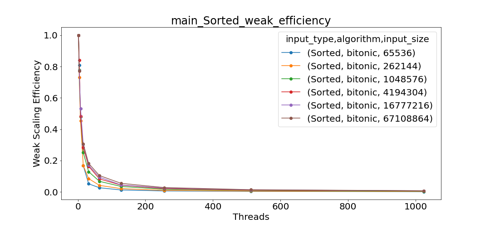
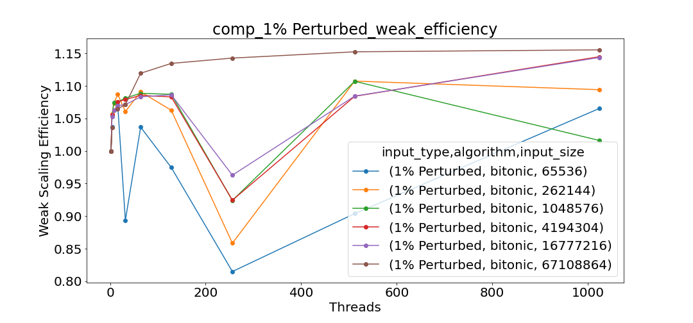

# Merge Sort Analysis: Maximiliano Pombo
This document will focus on the analysis of the parallelized bitonic sort algorithm that was implemented for this project using a variety of different visualizations generated from Caliper files. The report file specified the following graphs to analyze for the presentation, so the graphs I will be analyzing in this document are:

Only a subset of these will be in our final presentation, but the below will include a detailed analysis on each of these groups. These were tested with array sizes 2^16, 2^18, 2^20, 2^22, 2^24, 2^26, 2^28, process numbers 2, 4, 8, 16, 32, 64, 128, 256, 512, 1024, and input types sorted, random, reverse sorted, and 1% perturbed.

## Main: Total Time for Program Execution
For the measurements for this section, we used Max time/rank from the Cali file, which would be the time taken by the task that does the final merge and the correctness check.

### Strong Scaling Plots
This section has 6 graphs that span the seven different array sizes specified above, with each one having a line for each input type. the most important observations from these graphs are the following:

- The smallest array size, 65536, shows that the total program time actually increases as more processes are added. This is because the added communication overhead for additional processes heavily outweighs any benefit to computation time that those processes add on such a small problem size.
- For all input sizes, the type of input (sorted, reverse, random, perturbed) didn't have a large effect on performance. This is due to the way bitonic sort works, as it is an oblivious sorting algorithm that performs the same sequence of comparisons and swaps regardless of the initial order of the elements. Bitonic sort follows a fixed pattern of merging and sorting phases, making it insensitive to input distribution and maintaining consistent performance across different input types.
- For input sizes "262144, 1048576, 4194304, 16777216" we see an increase in time when using 128 processors. This might be due to the overhead associated with managing and synchronizing a larger number of processors. As the number of processors increases, communication and coordination between processors become more complex and can introduce latency, especially if the problem size is not large enough to efficiently utilize all the processors.
- As the problem size got large enough to make all the added processes helpful, the graph formed a smooth exponential decrease for all input types.

### Strong Speedup/Weak Efficiency Plots
These graphs show both the strong speedup and weak efficiency relative to time on two processes for all of the given input types. Each graph has a line for every input size. The observations we can make are as follows:

- There isn't a significant difference between these graphs for permuted, random, reversed, and sorted data, because they all follow the same trends even if the times differ slightly.
- The bitonic sort algorithm demonstrates significantly higher speedup with larger input sizes, peaking around 9 for the largest dataset (26,843,546) in random input scenarios, while smaller datasets yield lower speedup values.
- Across various input types (1% perturbed, random, reverse sorted, and sorted), the algorithm maintains a robust performance, with maximum speedup levels generally ranging from 6 to 8, indicating its effectiveness in a parallel processing environment.
- Weak efficiency sharply decreases as the number of threads increases, approaching zero at higher thread counts, highlighting that simply adding threads does not equate to effective utilization of computational resources.

## Comp_Large: Average Time Spent Computing (Sorting) Per Processor
For the measurements for this section, we used Avg time/rank from the Cali file, which would be the average amount of time each task takes to sort and merge its sections of the array.

### Strong Scaling Plots
These graphs are set up the same way as the strong scaling graphs for main, with the following observations:

- Unlike the graphs for main, these graphs generally decrease exponentially for every problem size 
- For larger input sizes (like 4,194,304 and 16,777,216), the time reduction begins to plateau as the number of threads approaches 1,000, suggesting diminishing returns for adding more threads beyond a certain point.
- These graphs follow the same trend between input types where the input type seems to have little to no effect on the execution times.
- These graphs all tend to approach 0 even for large problem sizes, demonstrating that for large computations, there is no bottleneck added as more processes are added. If we were to include comp_small in these, there would likely be a small bottleneck but not much. In addition, these graphs seem to decrease faster than the ones for main, which we will verify in the next section by analyzing the strong speedup/weak efficiency plots.

### Strong Speedup/Weak Efficiency Plots
These graphs show strong speedup and weak efficiency for the large computations in our program. We can observe the following:

- The bitonic sort algorithm exhibits good speedup across various input sizes, indicating its robust performance in parallel processing environments, particularly with larger datasets.
- All input types (1% perturbed, random, reverse sorted, and sorted) show similar speedup trends, suggesting that the algorithm effectively harnesses available threads regardless of data arrangement.
- Weak efficiency remains around 1.0 to 1.1 for most thread counts, demonstrating efficient utilization of computational resources; however, occasional dips highlight variability in performance, particularly at certain thread counts.
- The minor fluctuations in weak efficiency across different input types indicate that while the algorithm generally scales well, there are challenges related to workload management and thread utilization that could be optimized further.

## Comm: Average Time Spent Communicating Per Processor
For the measurements for this section, we used Avg time/rank from the Cali file, which would be the average amount of time each task spends sending or receiving data from other tasks.

### Strong Scaling Plots
These graphs are set up the same way as the strong scaling graphs for main, with the following observations:

- Across all input sizes, communication time drops significantly as the number of threads increases, particularly noticeable from 0 to about 200 threads, where there is a sharp decline.
- For larger thread counts (beyond 200), the communication time stabilizes at very low levels (close to 0 seconds), suggesting that increasing the number of threads further does not significantly impact the communication time due to efficient handling of data in parallel.
- The communication time analysis of the bitonic sort algorithm reveals that it scales effectively with increasing thread counts, demonstrating a significant reduction in overhead as the workload is distributed. This efficiency is consistent across various input sizes and types, suggesting that the algorithm is well-optimized for parallel processing environments, even as input complexity increases.

### Strong Speedup/Weak Efficiency Plots
These graphs show strong speedup and weak efficiency for the communication between tasks in our program (such as send and receive). We can observe the following:

- The graphs show a sharp increase in speedup at lower thread counts, particularly for input types with smaller sizes (e.g., 65536 and 262144). This suggests that increasing the number of threads significantly enhances performance up to a certain point, highlighting the effectiveness of parallel processing in handling smaller data sets.
- The weak efficiency graphs demonstrate an initial spike in efficiency at low thread counts, followed by a sharp decline as the number of threads increases. This indicates that while more threads can improve speed, the efficiency per thread drops significantly, particularly evident with larger input sizes.
- The results indicate a clear trade-off between speedup and weak efficiency. While utilizing more threads can lead to substantial speed improvements, it often comes at the cost of efficiency. This underscores the importance of optimizing thread usage and considering input characteristics to achieve the best performance in parallel algorithms. 

### Overall performance
The bitonic sort algorithm is well-suited for parallelization because it inherently breaks down the data into independent subproblems that can be sorted separately. While it struggled with smaller input sizes and did not benefit from parallel processing, its performance significantly improved as the input size increased, demonstrating its effective use of parallelism for larger datasets.

## Possible Optimizations Missed
After running all of my analysis and looking at my code structure, I determined a few optimizations that could be done: 
- Dynamic Load Balancing and Thread Pooling: Implementing dynamic load balancing can ensure even distribution of workloads across threads, while using thread pooling can reduce the overhead of thread creation and destruction, enhancing overall performance.
- Minimizing Communication Overhead and Cache Optimization: Strategies to reduce inter-thread communication, such as shared memory usage, and optimizing memory access patterns to improve cache locality can significantly lower latency and improve sorting efficiency.
- Algorithmic Refinements and Utilization of Modern CPU Capabilities: Exploring hybrid sorting techniques, algorithmic adaptations based on input characteristics, and employing SIMD (Single Instruction, Multiple Data) instructions can enhance performance by better leveraging available computational resources.
