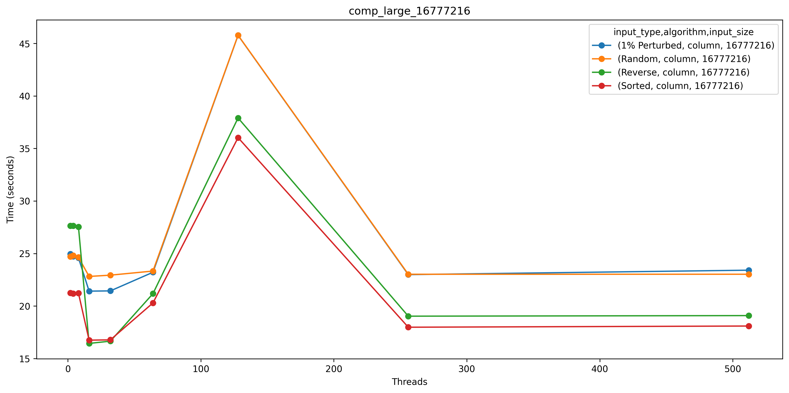
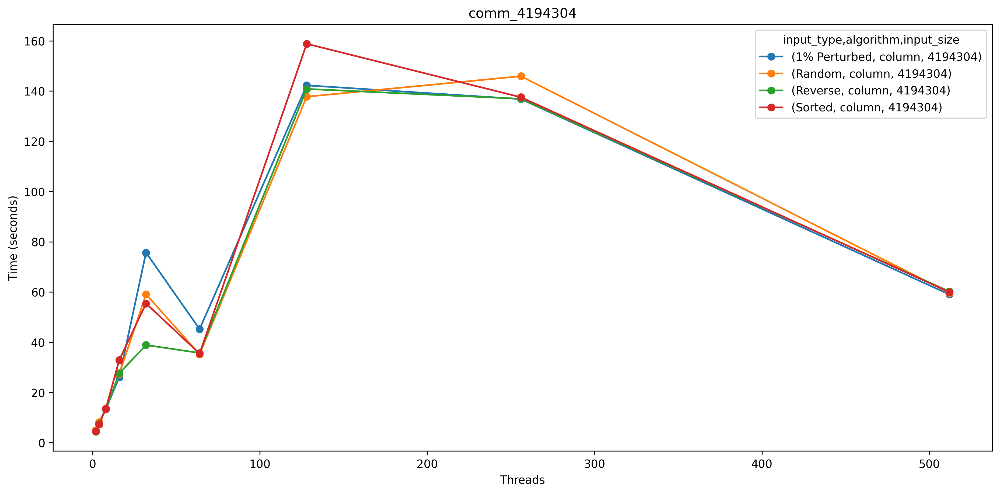

# Column Sort Analysis: Patralika Ghosh
My implementation of the column sort closely follows and is largely based on Leighton's Column Sort algorithm. The algorithm generates the array according to the input type, and each process is assigned a portion of indexes based on the input size and the number of processes. Each process then sorts its assigned column and returns the sorted result. This part of the code is parallelized, however due to high communication overhead I was not able to parallelize the entire algorithm properly. Next, I transpose the matrix with the sorted columns and reshape it into submatrices of size (r/c) x r, where r is the number of rows and c is the number of columns. I repeat the process of column sorting and re-tranpose the matrix back to its original form. Afterward, I perform a shift in the matrix, where one half of the first column is filled with -inf values and the other half of the last column is filled with +inf values. I sort the columns again, then remove the -inf and +inf values, resulting in a fully column-sorted matrix.
Since my implementation lacks sufficient parallelization, I am missing a couple of Caliper files because of network errors that I faced while trying to run my program for 1024 and 512 number of processors. My program is timing out for the largest array size for processors 32 and onwards and when it is run on number of processes for 512 and 1024. 

The way I could improve the performance of my algorithm is to try to completely parallelize my algorithm since column sort is a parallel algorithm. Increasing the amount of parallelization of my algorithm will help me reduce the overall computation time of my algorithm.

## Main: Total Time for Program Execution
For the measurements for this section, we used Max time/rank from the Cali file, which would be the time taken by the task that does the final merge and the correctness check.

### Strong Scaling Plots

### Strong Speedup/Weak Efficiency Plots

## Comp_Small: Average Time Spent Computing (Sorting) Per Processor
For the measurements for this section, we used Avg time/rank from the Cali file, which would be the average amount of time each task takes to sort and merge its sections of the array.
### Strong Scaling Plots

### Strong Speedup/Weak Efficiency Plots

## Comm: Average Time Spent Communicating Per Processor
For the measurements for this section, we used Avg time/rank from the Cali file, which would be the average amount of time each task spends sending or receiving data from other tasks.

### Strong Scaling Plots

### Strong Speedup/Weak Efficiency Plots

