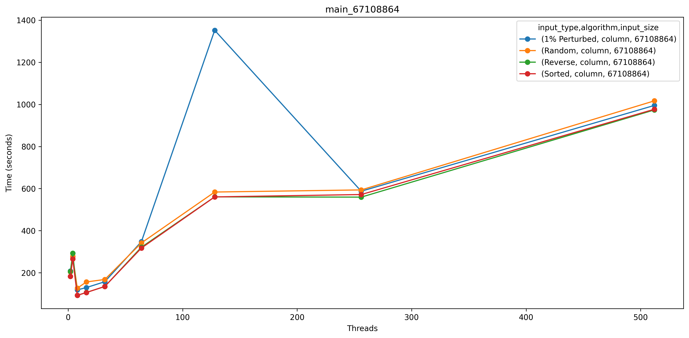
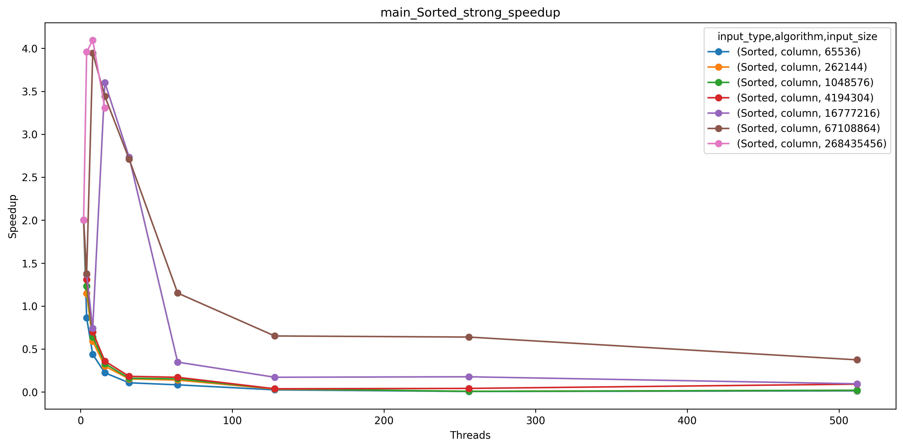
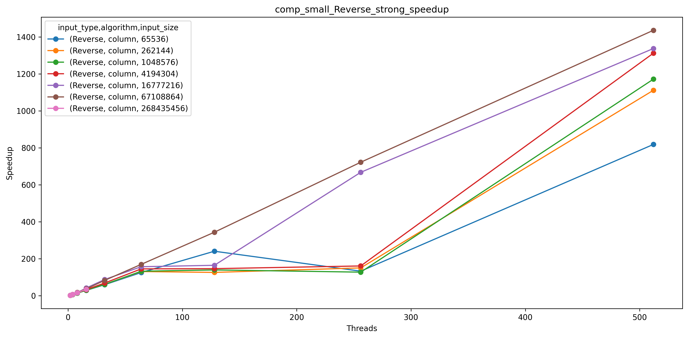
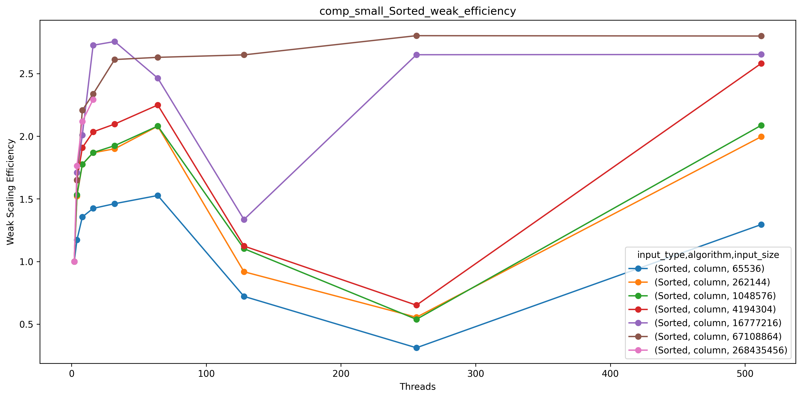
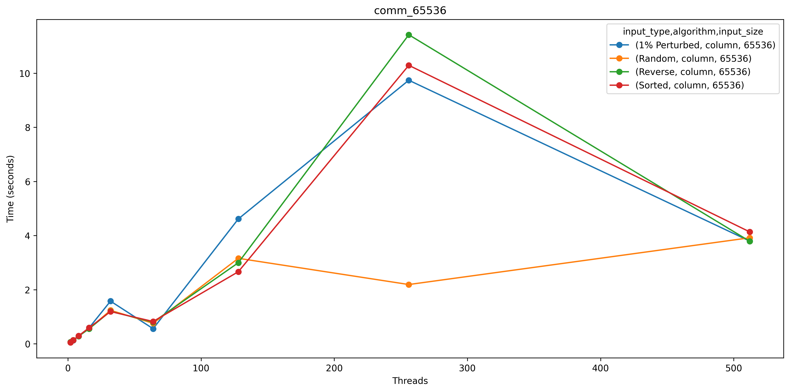
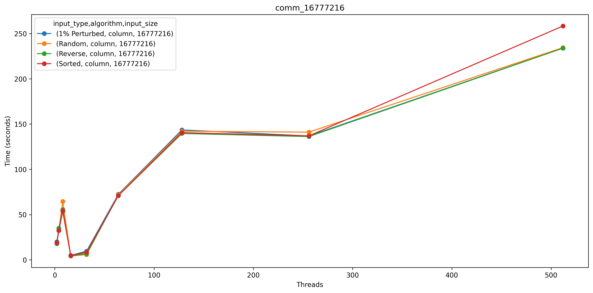
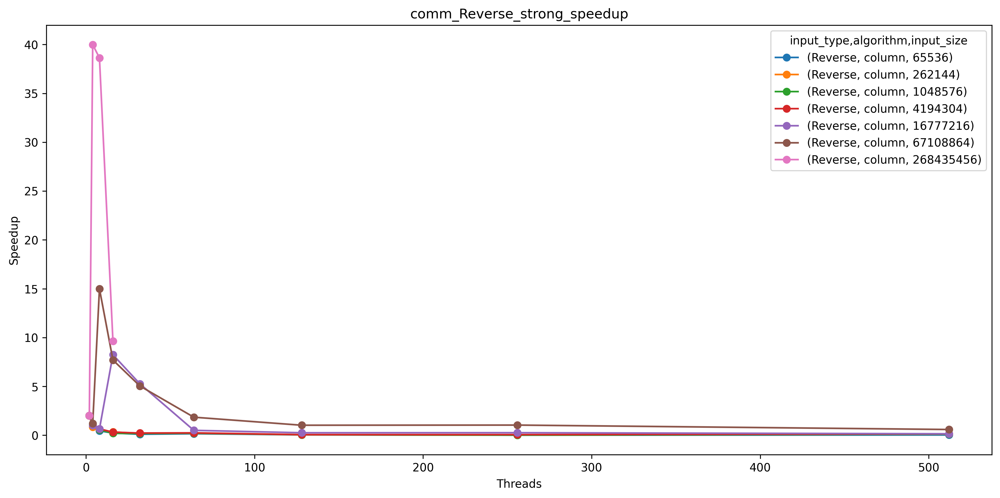

# Column Sort Analysis: Patralika Ghosh
My implementation of column sort closely follows Leighton’s Column Sort algorithm. The algorithm generates an array based on the specified input type, then distributes portions of the array across processes according to input size and the number of processes. Each process is responsible for sorting its assigned column and returning the sorted result. While this section of the code is parallelized, I encountered challenges with high communication overhead and synchronization, preventing me from fully parallelizing the algorithm. I experienced a number of problems as I tried to parallelize the algorithm further such as stalling at the end and Caliper files not generating properly. 

After the initial column sorting, I transpose the matrix and reshape it into submatrices of size (r/c)×r, where 
r represents the number of rows and c the number of columns. The process of column sorting is then repeated, and the matrix is transposed and reshaped back to its original configuration. Next, I introduce a shift in the matrix, setting the first half of the first column to −inf values and the last half of the last column to +inf values. After another round of column sorting, I remove the -inf and +inf values, resulting in a fully sorted matrix. The column sort algorithm only works on matrices that are not square matrices, the rows >= columns and c = 2*(columns-1)^2 and r%c == 0. Using this I tried to calculate a number that I could run for all input types, so I picked 16 since it satisfied all the above conditions. 

But as I ran my program with more number of processes, the overall runtime increased so I increased the number of columns and modified the rows accordingly. I cannot choose a high number like 512 because for 512 rows I can only run the test case with array of size 2^28. My algorithm seems to depend on how the data is distributed because I use std::sort for sorting each column locally which is easier with a small input size. 

So, these are what I ran for each test case and I kept the same configuration for each input type such as sorted, reverse sorted, 1 % perturbed and random.

I faced network errors while running the program on 1024 processors, leading to missing Caliper profiling files for this configuration. Additionally, the program times out when processing the largest array size with 32 processors or more. To improve performance, I need to enhance the parallelization of my algorithm, as column sort is inherently parallel. 

## Main: Total Time for Program Execution

For the measurements for this section, we used Max time/rank from the Cali file, which would be the time taken by the task that does is the entire algorithm.

### Strong Scaling Plots

For smaller input sizes, using fewer threads might be more efficient because the overhead from managing communication between threads can outweigh the benefits of parallelization.

For larger input sizes, improving the way processes are handled can help keep the performance gains going beyond the initial improvement phase (around 2–4 threads). Also, finding ways to balance the workload across threads could improve efficiency, especially for different input types.

### Strong Speedup/Weak Efficiency Plots

The plots show that the algorithm's ability to scale effectively drops off as more threads are used. Speedup quickly decreases after a certain point, and the weak scaling efficiency becomes nearly zero when many threads are involved. This suggests that communication between threads becomes a major issue, slowing things down.
Larger input sizes generally perform better, with higher speedups and better efficiency for a longer time, but they still struggle with performance as thread count grows. Smaller input sizes face the most trouble, even showing worse performance as the overhead from parallelization becomes too large compared to the actual computation.

## Comp_Small: Average Time Spent Computing (Sorting) Per Processor

For the measurements for this section, we used Avg time/rank from the Cali file, which would be the average amount of time each task takes to sort and merge its sections of the array. This part of the column sort algorithm is parallelized.

### Strong Scaling Plots

For all input sizes, the time taken significantly decreases as the number of threads increases, showing a sharp drop from 0 to 32 threads. However, the performance gains diminish beyond a certain thread count, indicating diminishing returns with higher parallelization.

For these smaller inputs, there’s a steep initial drop in time taken as threads increase from 1 to around 32, after which the time remains nearly constant. This suggests that the overhead of additional processors outweighs the benefit for smaller input sizes beyond this point.The results are consistent across different input types, meaning the algorithm's performance is relatively independent to the input type.

For the largest input size, the plot only goes up to 16 threads and shows a more gradual decline in time with increasing threads. This suggests that the problem is large enough to benefit from parallelization across all available threads within this range.

### Strong Speedup/Weak Efficiency Plots

For all input types, there is a clear increase in speedup as the number of threads increases, especially for larger input sizes. This shows that the algorithm benefits from parallelization, achieving better speedup with more threads. Speedup improves consistently up to 512 threads, with larger input sizes achieving the highest speedup, which is expected since larger datasets benefit more from parallel processing. Smaller input sizes see diminishing returns in speedup as threads increase, indicating that communication and synchronization overhead start to dominate at higher thread counts for smaller data sizes. Larger inputs generally show higher speedup across all thread counts, which suggests that the algorithm scales better with increasing data size. This aligns with the expectation that larger workloads offer more opportunities for parallel processing to be effective.

Weak scaling efficiency starts high with low thread counts, dips for 128 and 256 processorts and then recovers as threads increase up to 512. For larger input sizes, efficiency remains closer to optimal (i.e., around 1.0 or above) even as the number of threads grows, especially at higher thread counts. This suggests that larger inputs handle the added overhead more effectively. The dips and peaks in the efficiency plots can be as a result of changing the rows to columns ratio or how I distributed the data in the matrix, which I added a table above of how I have been changing it.

Sorted inputs show lower efficiency at smaller input sizes across all thread counts, as the parallelization overhead outweighs any benefits when there is less work to be done. Reverse inputs maintain moderately high efficiency across all thread counts but don’t reach the peak levels of 1% Perturbed data. The Random input type shows larger drops in efficiency at mid-range thread counts compared to other inputs, particularly for smaller input sizes. The 1% Perturbed input tends to maintain higher efficiency than other input types across most thread counts, especially for larger input sizes.

## Comp_Large: Average Time Spent Computing (Sorting) Per Processor
For the measurements for this section, we used Avg time/rank from the Cali file, which would be the average amount of time it takes to tranpose, retranpose, shift and unshift the matrix. This part of the algorithm is sequential.

### Strong Scaling Plots

### Strong Speedup/Weak Efficiency Plots

## Comm: Average Time Spent Communicating Per Processor
For the measurements for this section, we used Avg time/rank from the Cali file, which would be the average amount of time each task spends sending or receiving data from other tasks.

### Strong Scaling Plots

For smaller input sizes, as more threads are added, the execution time increases steadily, showing that the algorithm doesn’t scale well. The extra work required to manage multiple threads isn’t worth it, and the algorithm might actually run faster with just one thread or a few.
For larger input sizes, the algorithm shows good performance improvement up to 4 threads, but after that, the gains level off. This indicates that while the algorithm is suited for bigger datasets, there’s a point where the communication overhead becomes too much as more threads are added.

### Strong Speedup/Weak Efficiency Plots

The algorithm struggles to scale effectively as more threads are used. Speedup and efficiency drop quickly, especially when using more than 8 threads, regardless of the input size. This suggests that the current parallelization approach may not be well-suited for managing a large number of threads efficiently.
Larger input sizes perform better at first, showing higher speedup and efficiency, which indicates that the algorithm works best when each thread has more work to do. This minimizes the effect of communication overhead. However, even with larger input sizes, the benefits of adding more threads quickly decrease as the thread count rises.

