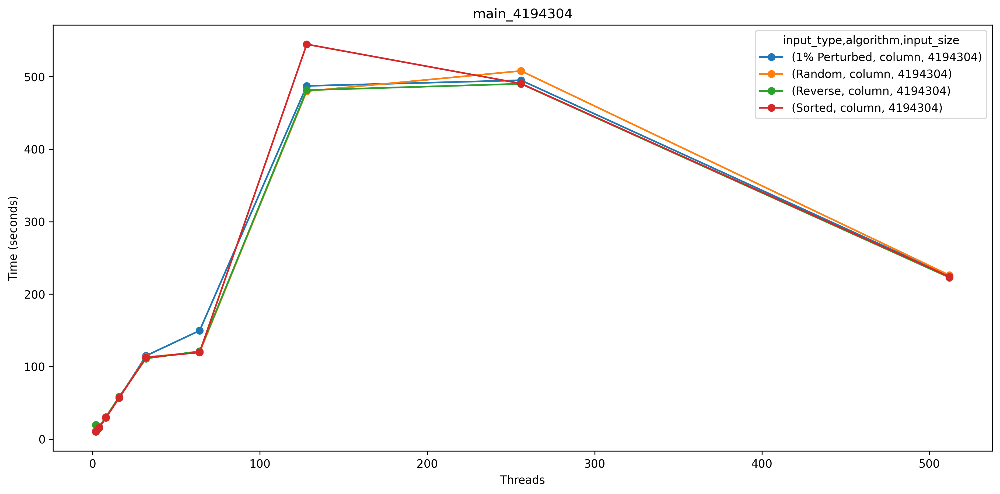
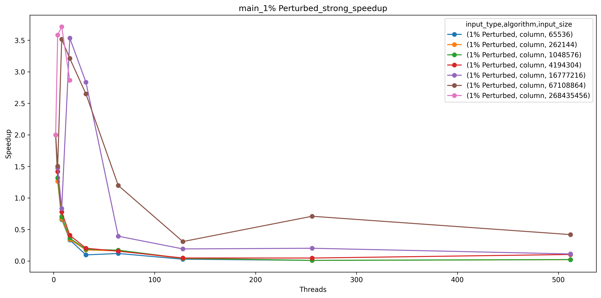
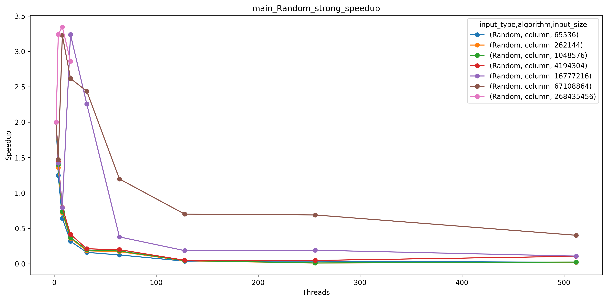
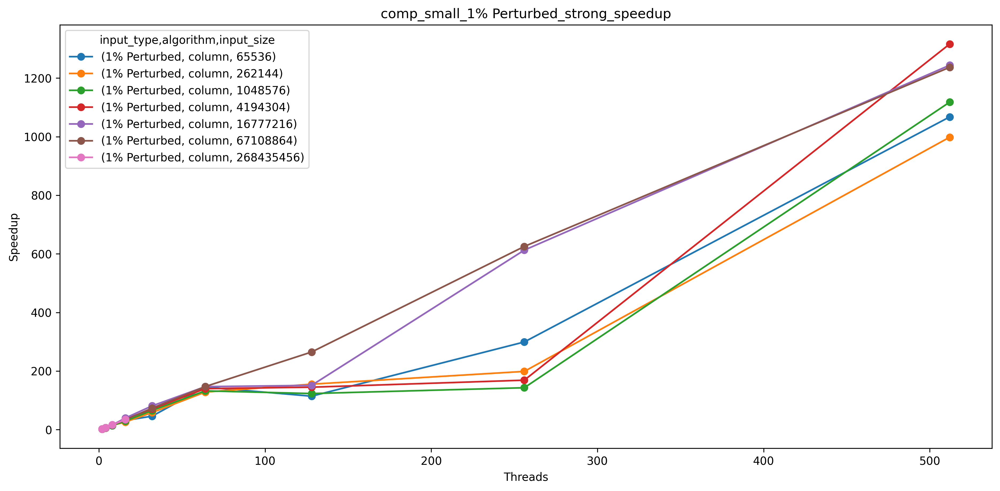
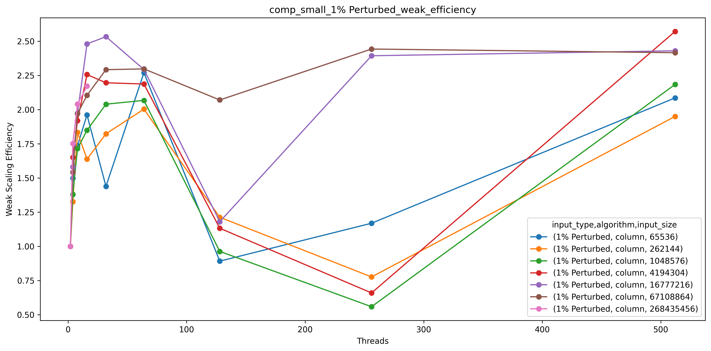
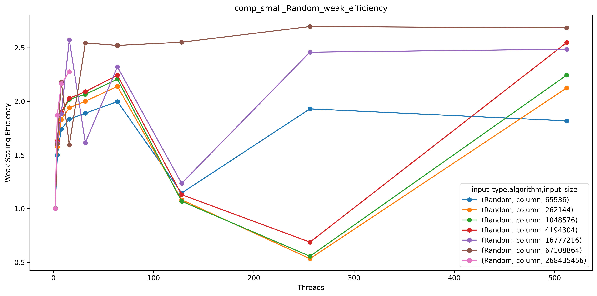
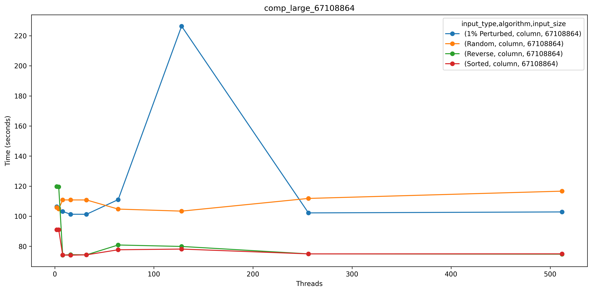
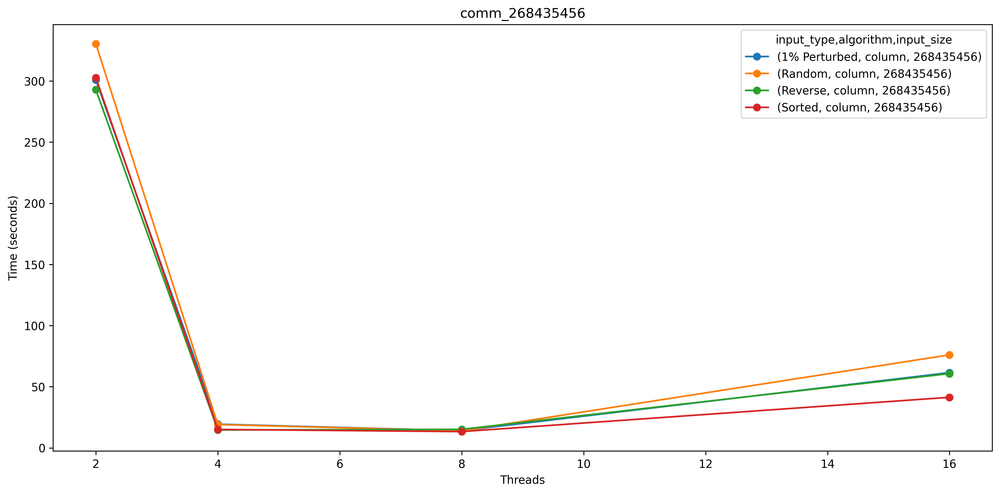
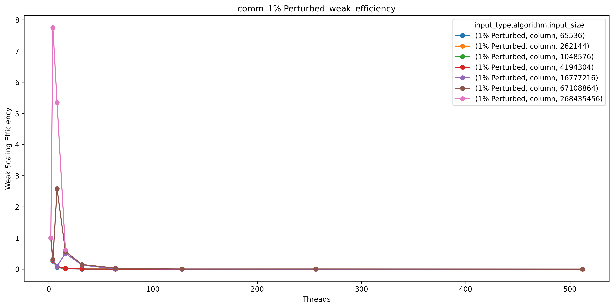

# Column Sort Analysis: Patralika Ghosh
My implementation of column sort closely follows Leighton’s Column Sort algorithm. The algorithm generates an array based on the specified input type, then distributes portions of the array across processes according to input size and the number of processes. Each process is responsible for sorting its assigned column and returning the sorted result. While this section of the code is parallelized, I encountered challenges with high communication overhead and synchronization, preventing me from fully parallelizing the algorithm. I experienced a number of problems as I tried to parallelize the algorithm further such as stalling at the end and Caliper files not generating properly. 

After the initial column sorting, I transpose the matrix and reshape it into submatrices of size (r/c)×r, where 
r represents the number of rows and c the number of columns. The process of column sorting is then repeated, and the matrix is transposed and reshaped back to its original configuration. Next, I introduce a shift in the matrix, setting the first half of the first column to −inf values and the last half of the last column to +inf values. After another round of column sorting, I remove the -inf and +inf values, resulting in a fully sorted matrix. The column sort algorithm only works on matrices that are not square matrices, the rows >= columns and c = 2*(columns-1)^2 and r%c == 0. Using this I tried to calculate a number that I could run for all input types, so I picked 16 since it satisfied all the above conditions. 

But as I ran my program with more number of processes, the overall runtime increased so I increased the number of columns and modified the rows accordingly. I cannot choose a high number like 512 because for 512 rows I can only run the test case with array of size 2^28.

So, these are what I ran for each test case and I kept the same configuration for each input type such as sorted, reverse sorted, 1 % perturbed and random.

I faced network errors while running the program on 1024 processors, leading to missing Caliper profiling files for this configuration. Additionally, the program times out when processing the largest array size with 32 processors or more. To improve performance, I need to enhance the parallelization of my algorithm, as column sort is inherently parallel. 

## Main: Total Time for Program Execution
For the measurements for this section, we used Max time/rank from the Cali file, which would be the time taken by the task that does the final merge and the correctness check.

### Strong Scaling Plots

### Strong Speedup/Weak Efficiency Plots

## Comp_Small: Average Time Spent Computing (Sorting) Per Processor
For the measurements for this section, we used Avg time/rank from the Cali file, which would be the average amount of time each task takes to sort and merge its sections of the array.
### Strong Scaling Plots

### Strong Speedup/Weak Efficiency Plots

## Comp_Large: Average Time Spent Computing (Sorting) Per Processor

## Comm: Average Time Spent Communicating Per Processor
For the measurements for this section, we used Avg time/rank from the Cali file, which would be the average amount of time each task spends sending or receiving data from other tasks.

### Strong Scaling Plots

### Strong Speedup/Weak Efficiency Plots

